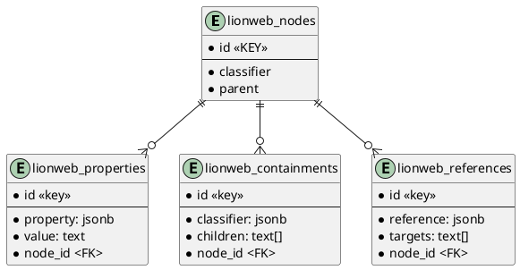

# lionweb-repository
Reference implementation of LionWeb repository

## Postgres
The database used for storage of models is Postgres, 
the easiest way to set up Postgres is through docker.

The Postgres version currently being used is: : postgres:16.1.
The `.env` file contains the user/database/port names and numbers being used.

plantuml::database-schema.puml[format=svg]

## 

