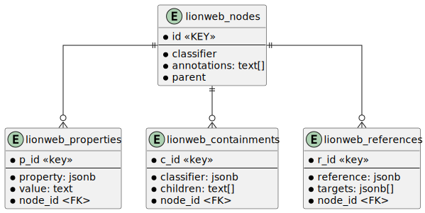

# lionweb-repository
Reference implementation of LionWeb repository

## Changes in Version 0.3.0

- Support for LionWeb 2024.1
- Removed `init` request from dbAdmin
- Request `createRepository` in dbAdmin has additional **mandatory** parameter `lionWebVersion`
  - All tests and applications need to add this parameter    
  - The server config section for creating repositories also has this additional field 
- All requests fail if the LionWeb version of the chunk is not the same LionWeb version as the repository. 
- 

## Postgres
The database used for storage of models is Postgres, 
the easiest way to set up Postgres is through Docker.

The Postgres version currently being used is: postgres:16.1.
The `.env` file contains the user/database/port names and numbers being used.



The `lionweb_properties.property`, `lionweb_containments.containment` and `lionweb_references.reference` 
fields are LionWeb metapointers.

We use `pgAdmin 4` to test queries and look directly into the database. 

### How to start Postgres through docker

```
# download docker
docker pull postgres:16.1

# create a container and run it
docker run --shm-size=1g -d --name lionwebrepodb -p 5432:5432 -e POSTGRES_PASSWORD=lionweb postgres:16.1
```

### How to build

```
npm install
npm run build
npm run lint
```

### How to start the repository server
Ensure that Postgress is running.
The repository server is started with `npm run dev-run` in  the `packages/server` folder:

```
cd packages/server
npm run dev-run
```

For more information on how to configure the repository, please check [configuration.md](configuration.md).

### How to test
Ensure the Postgres server and the repository server are both running.
Then do

```
npm run test
```

## Status
This repository is Work In Progress, currently:
- Changes in children: adding, removing, moving are supported
- Changes of property values are supported
- Changes of reference targets are supported
- Changes of annotations are supported.
- changes of order of containments, references and annotations are supported.  

##  Main Packages

### dbadmin
Contains code to manipulate the Postgres database (create, initialize)

### server
The main repository server.
Manages the connections to the databes.
Gets all apis from other packages.

### common
Utitilty classes and functions shared by all other packages.

## API packages
These packagesa all provide an API with one or more functions.

### bulkapi
The API's for the bulk protocol as specified in LionWeb.

### additionalapi
Some additiona API functions.

### inspection
API's to inspect the contents of the nodes table.

### languages
Thye API funxctions to add/remove LionWeb languages to the repository.
NOTE: not implemented yet, ist is a placeholder.


### test
Tests for the core package

## CI
In GitHub actions a Postgres server is started on a host named `postgres`.
In your local development environment, this hostname is also being used.
You need to ensure that this hostname points to the Postgres server. 

## Authentication

It is possible to specify a token to be expected by the server in each request (see [configuration.md](configuration.md)).
This mechanism is intended to make possible to expose the LionWeb repository while providing a minimum level of 
security. When the token is specified while launching the server, then each request to the server will be checked
for the presence of the same token in the `Authorization` header.

## How to perform a release

To release the lionweb server run the script `scripts/tag-and-release-docker-image.sh` from the root of the project. 
 
The details of how this works and how to answer the questions being asked
are described in the [README.md](scripts/README.md) in the scripts folder.

## How to use the Docker image

You can get the docker image from the Docker repository hosted by GitHub:

```
docker pull ghcr.io/lionweb-io/lionweb-repository:latest 
# alternatively you can specify a specific version
docker pull ghcr.io/lionweb-io/lionweb-repository:release-lionweb-repository-0.1.1
```
