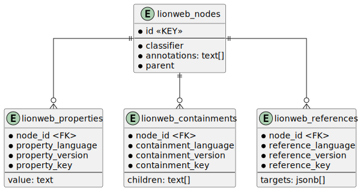

# lionweb-repository
Reference implementation of LionWeb repository

## Postgres
The database used for storage of models is Postgres, 
the easiest way to set up Postgres is through Docker.

The Postgres version currently being used is: : postgres:16.1.
The `.env` file contains the user/database/port names and numbers being used.

The `jsonb` types properties are LionWeb metapointers.

We use `pgAdmin 4` to test queries and look directly into the database. 

##  Source code in ./src

### Tools
Constain code to manipulate the postgres database (create, initialize)

### 

## CI
In Github actions a postgres server is started on a gost named `postres`.  In you local development environment this hostname is also being used. You need to ensure that this hostname points to the postgres server. 
